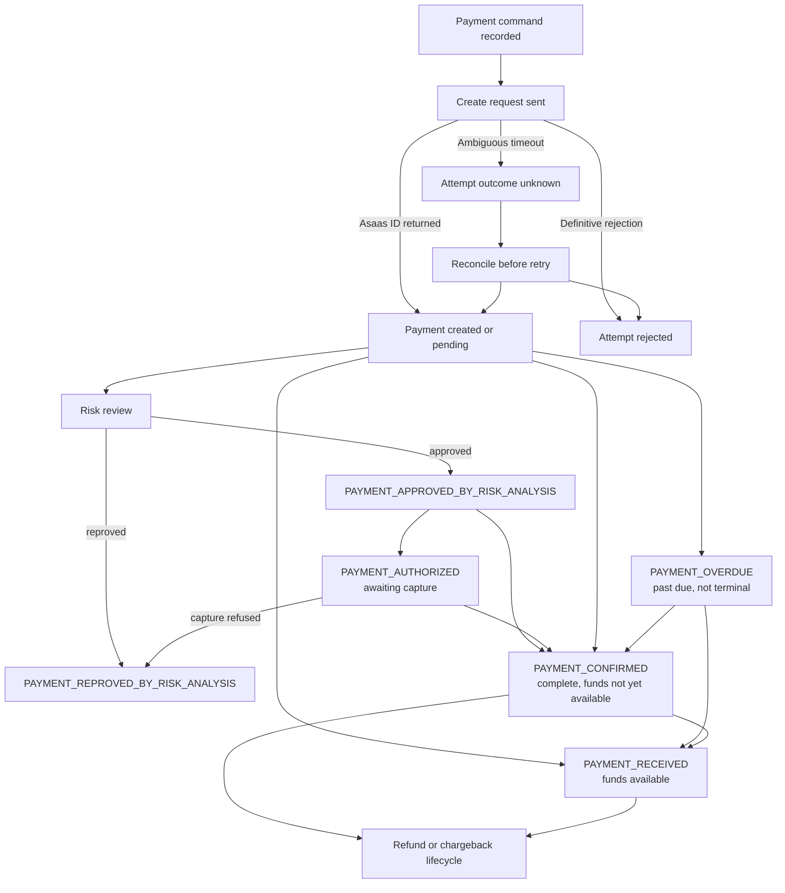

# Payment Lifecycle and State Transitions

## Purpose

This document defines the initial payment lifecycle model for Easy Asaas Integration. It separates local command attempts, the Asaas payment resource, and post-payment adjustments such as refunds and chargebacks. It is based on official Asaas documentation reviewed on 2026-10-08; verify current endpoint contracts before implementation.

The model is Asaas-specific. It does not define a provider-neutral payment state machine or attempt to make every payment method follow one identical sequence.

## Three related lifecycles

### 1. Local payment command and attempt

The application records the requested operation and its idempotency key before sending a create request. A payment attempt records the result of that particular call to Asaas.

| Attempt state | Meaning |
|---|---|
| `prepared` | The validated command is ready to be sent. |
| `submitting` | The request is being sent to Asaas. |
| `accepted` | Asaas returned a payment identifier; continue tracking the payment independently. |
| `rejected` | A definitive response says the request was not accepted. |
| `outcome_unknown` | A timeout or connection failure occurred after the request may have reached Asaas; acceptance is not known. |

An `outcome_unknown` attempt must not be retried blindly. Reconcile using the stored external reference or an occasional Asaas lookup before creating another charge. The application idempotency key prevents repeated client commands from creating additional intended operations; it does not make an ambiguous network result safe by itself.

### 2. Asaas payment lifecycle

The local payment record holds the Asaas payment ID, the latest known Asaas status, and the source of the latest update. Keep the provider's event and status facts distinguishable from any simpler label shown in the user interface.

The diagram shows common collection paths, not an exhaustive transition contract. In particular, Asaas documents that a payment can move from `PAYMENT_OVERDUE` to `PAYMENT_CONFIRMED` and then `PAYMENT_RECEIVED`; overdue is not a terminal state. Pix payments may move directly from created to received. Card payment authorization and risk-analysis events add other intermediate steps.

### 3. Refund and chargeback adjustments

Refunds and chargebacks are related to a payment but are not interchangeable with its collection status.

- A payment can have multiple refund entries, including partial refunds.
- Refund entries have their own status: `PENDING`, `CANCELLED`, or `DONE`.
- Do not mark a refund complete because a refund entry exists; confirm `DONE` and account for each returned amount.
- Asaas chargeback events describe a dispute lifecycle. A dispute won by the merchant can return to `PAYMENT_CONFIRMED` or `PAYMENT_RECEIVED`; a dispute won by the cardholder can result in `PAYMENT_REFUNDED`.
- Track the refund or dispute details separately from the original charge, then derive any customer-facing summary from both records.

## Important Asaas payment facts

| Asaas fact or event | Domain interpretation |
|---|---|
| `PAYMENT_CREATED` | A charge exists. It does not mean the payer has paid. |
| `PAYMENT_AWAITING_RISK_ANALYSIS` | Card payment is awaiting risk review; it is not a received payment. |
| `PAYMENT_APPROVED_BY_RISK_ANALYSIS`, `PAYMENT_REPROVED_BY_RISK_ANALYSIS` | Risk-review outcomes; approval is not itself evidence that funds are available. |
| `PAYMENT_AUTHORIZED` | Card payment is authorized and awaiting capture; it is not the same as funds being available. |
| `PAYMENT_CONFIRMED` | Payment is complete, but Asaas says the funds are not yet available. |
| `PAYMENT_RECEIVED` | Funds are available in the Asaas account. |
| `PAYMENT_OVERDUE` | The due date passed without payment; later confirmation or receipt can still occur. |
| `PAYMENT_CREDIT_CARD_CAPTURE_REFUSED` | Card capture failed; record the provider event and expose the appropriate recovery path. |
| `PAYMENT_PARTIALLY_REFUNDED`, `PAYMENT_REFUND_IN_PROGRESS`, `PAYMENT_REFUND_DENIED`, `PAYMENT_REFUNDED` | Refund-related events; inspect the refund records and amounts instead of reducing these to a single boolean. |
| `PAYMENT_CHARGEBACK_REQUESTED`, `PAYMENT_CHARGEBACK_DISPUTE`, `PAYMENT_AWAITING_CHARGEBACK_REVERSAL` | Chargeback lifecycle events that can affect a previously confirmed or received payment. |
| `PAYMENT_DELETED`, `PAYMENT_RESTORED`, `PAYMENT_BANK_SLIP_CANCELLED` | Administrative or boleto-registration events; they are not interchangeable with receipt or refund. |

Asaas can add event fields over time. The webhook decoder must tolerate unknown fields. An unknown event type must be persisted and made observable rather than silently discarded or causing the entire processing loop to fail.

## State update rules

1. **Creation is not receipt.** A successful create response and the existence of an Asaas payment ID only establish that the charge was created.
2. **Persist before acknowledging.** Store the incoming webhook event in the PostgreSQL inbox before returning the success response to Asaas.
3. **Deduplicate by Asaas event ID.** A duplicate event must not repeat domain effects or downstream messages.
4. **Do not use arrival order as payment truth.** Asaas supports sequential and non-sequential webhook delivery. In non-sequential mode, events can arrive out of order.
5. **Keep the event history.** Record the event ID, event type, payment ID, received time, processing outcome, and the resulting provider status. Do not overwrite useful history with a last-write-wins update based only on webhook arrival time.
6. **Handle conflicts with reconciliation.** If an event is stale or conflicts with the known state, use an occasional status lookup for that payment and apply an explicit reconciliation rule. Do not continuously poll the API.
7. **Keep adjustments separate.** Refund and chargeback facts must not be reduced to a generic `paid`/`not paid` toggle.
8. **Keep subscription and payment state separate.** A subscription schedules charges; each generated payment has its own lifecycle and must be tracked individually.
9. **Do not trust browser callbacks as payment evidence.** Checkout redirects can improve navigation but do not replace verified Asaas events or reconciliation.

## User-facing payment summary

The reference interface may display concise labels, but they are projections of the provider facts rather than replacements for them. At minimum, the UI must distinguish:

- awaiting payment;
- overdue but still potentially payable;
- confirmed while settlement is pending;
- received with funds available;
- under risk review or awaiting card capture;
- failed or requiring a new payment action;
- refund pending, partially refunded, or refunded;
- chargeback or dispute in progress.

Exact copy, terminal-state rules, refund behavior, and which Asaas statuses map to each label require deterministic tests when implemented.

## Decisions for later documents

- Webhook persistence, retry policy, event ordering, and idempotency constraints are specified in the webhook strategy document.
- Exact event-to-domain mappings should be covered by contract tests against the documented Asaas payloads and Sandbox behavior.
- The domain glossary should define the terms `Payment`, `PaymentAttempt`, `Refund`, `Chargeback`, `PaymentStatus`, and `WebhookEvent` consistently.
- A change that moves lifecycle ownership across the domain, application, Asaas adapter, webhook, or persistence package boundaries must state whether an ADR is required.

This document does not require a separate ADR: it records initial domain behavior without changing package ownership or implementation boundaries.

## Official references

All references below are Asaas documentation. They were accessed on 2026-10-08.

- [Events for Payments](https://docs.asaas.com/docs/payment-events)
- [Webhooks FAQ](https://docs.asaas.com/docs/webhooks-faq)
- [Retrieve status of a payment](https://docs.asaas.com/reference/retrieve-status-of-a-payment)
- [List payments](https://docs.asaas.com/reference/list-payments)
- [Refunds](https://docs.asaas.com/docs/refunds)
