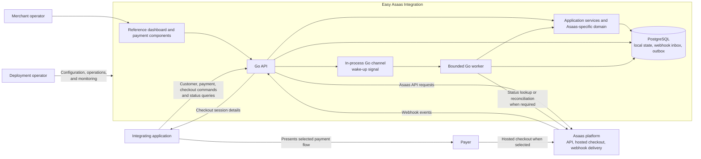

# System Context and Integration Boundaries

## Purpose

This document describes the people, external systems, and major responsibilities around Easy Asaas Integration. It establishes an initial context boundary for the architecture; it does not define API contracts, database schemas, or detailed deployment topology.

## System context

The diagram is logical, not a deployment mandate. The first deployment may run the API and worker in one Go process so an in-process channel can signal pending work. PostgreSQL remains the durable recovery mechanism. A separately run worker must discover pending work from PostgreSQL; a Go channel cannot carry signals between processes.

## People and external systems

| Actor or system | Relationship to Easy Asaas Integration |
|---|---|
| Integrating application | Requests customer, payment, subscription, or checkout operations and reads local payment status. |
| Merchant operator | Uses the reference dashboard to configure or inspect payment operations. |
| Payer | Completes a payment through the payment experience selected by the integrating application. |
| Deployment operator | Supplies secrets and configuration, operates the service and database, and monitors failures. |
| Asaas platform | Receives authenticated API requests and sends payment-related webhook events. It remains the external authority for Asaas payment records. |

## Internal responsibilities

### Go API

Accepts application commands and status queries, validates requests, invokes application services, and receives Asaas webhooks. It must persist an accepted webhook event before acknowledging it for processing.

### Application services and domain

Apply Asaas-specific use cases and payment lifecycle rules. Dependencies are explicit; interfaces are introduced at consumer boundaries where they improve substitution or testing, rather than to imply support for other providers.

### PostgreSQL

Stores local application state and durable webhook inbox and outbox records. The local payment status is a projection of known Asaas information, not a replacement for Asaas records. The webhook event ID is unique for deduplication.

### Go worker

Processes durable pending work with bounded concurrency, cancellation, retry handling, and graceful shutdown. A channel may reduce local processing latency, but loss of a channel signal must not lose the persisted work.

### Reference user interface and reusable components

Provide operator and payer-facing experiences through the Go API. Browser code must not receive the Asaas API key. Hosted or tokenized card flows must be used without storing raw card numbers or CVV.

## Trust and data boundaries

- Asaas credentials stay on the server and are provided through environment variables or a secret abstraction.
- Browser clients and payer devices are untrusted; they cannot determine authoritative payment status or hold provider credentials.
- Webhook requests are external input. Validate them using the Asaas mechanism established by the capability and security documentation, persist accepted events, and process them idempotently.
- Customer and payment data are sensitive. Minimize retention and avoid logging secrets, raw card data, and unnecessary personal information.
- Asaas is the external authority for provider-side payment records. Local state is updated from accepted Asaas events or explicit reconciliation, not from a browser redirect or payment-creation acknowledgement alone.

## Explicit exclusions

- Integrations with payment providers other than Asaas.
- A generic multi-provider payment abstraction.
- RabbitMQ in the initial architecture. Any future adoption needs a documented operational requirement and an ADR.
- AI in the payment execution path.

## Decisions deferred

- Whether API and worker ship as one process or separate deployables after initial operation.
- Whether the reference application is self-hosted only or also offered as a hosted service.
- Whether one deployment supports one Asaas account or multiple merchant accounts.
- Which interface delivers outbox messages to external consumers.

These decisions affect deployment, security, or module boundaries and must be resolved before the implementation commits that depend on them. A change that crosses module boundaries must state whether an ADR is required.
